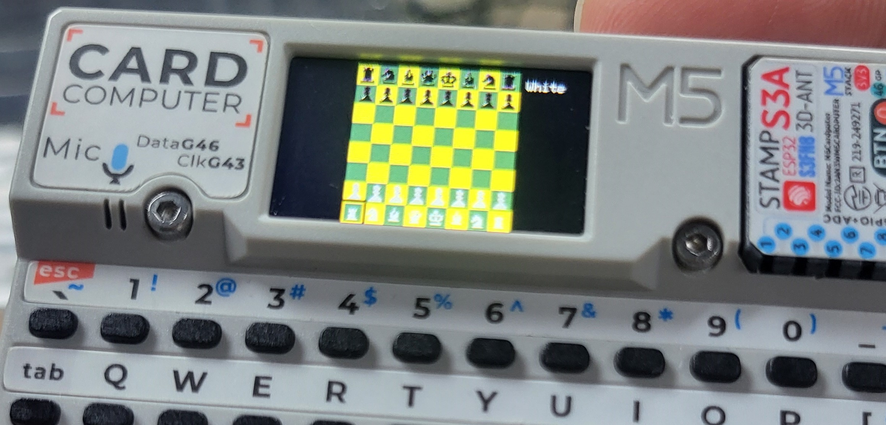

# CardChess

[English](#english) | [中文](#中文)

---

## 🎮 CardChess (English)

Offline Chess for M5Stack Cardputer
Play a full game of international chess locally on the Cardputer.
Board and piece designs are inspired by chess.com.

Controls:
; Up . Down , Left / Right Space Select / Move
AI opponent is now available！

### Hardware Requirements

*   M5Stack Cardputer

---

## 🎮 CardChess (中文)

M5Stack Cardputer 离线国际象棋游戏
在 Cardputer 上本地玩完整的国际象棋游戏。
棋盘和棋子的样式设计参考了 chess.com。

控制方式：
; 上移 . 下移 , 左移 / 右移 空格键 选择/移动
AI 对手现已可用！

### 硬件要求

*   M5Stack Cardputer